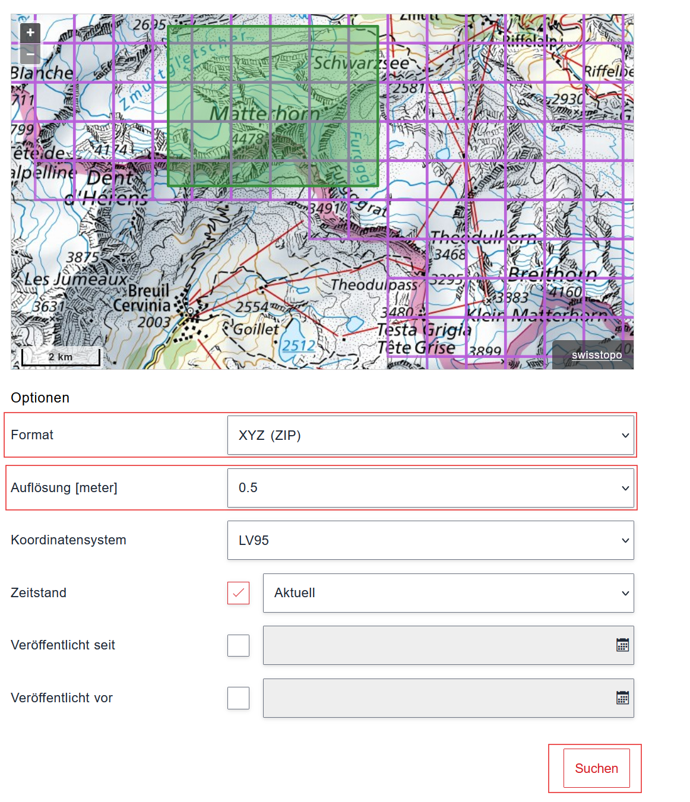
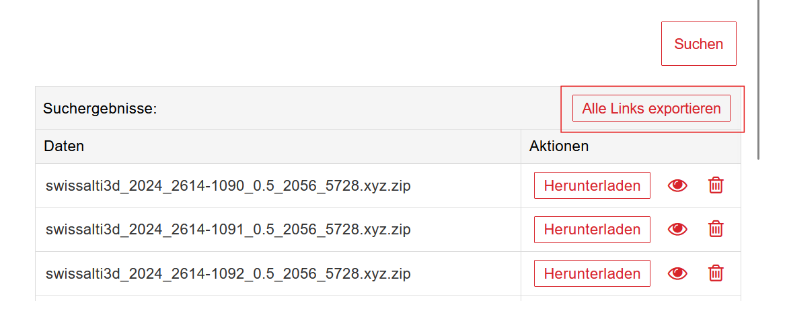

# SwissTopo STL Converter (GUI-first)

## Get the SwissTopo CSV (first step)

Download the CSV of swissALTI3D tiles from SwissTopo and place it into `data/` (recommended). The GUI can also browse to the CSV anywhere on disk and optionally copy it into `data/`.

1) Open the swissALTI3D page and select the tiles you want.
2) Export/download the CSV from the selection.
3) Save the CSV into `data/` (next to this README) so the GUI picks it up automatically.




Source page:
```
https://www.swisstopo.admin.ch/de/hoehenmodell-swissalti3d
```

This project is built around the GUI. Use it to download SwissTopo XYZ or GeoTIFF tiles, convert them into STL tiles, and merge them into a single printable STL with optional base.

**Prefer GeoTIFF (COG): it is much smaller.**
SwissTopo’s technical notes highlight the size difference between Cloud Optimized GeoTIFF (COG, LZW compressed) and ASCII XYZ:
- **0.5 m COG**: ~26 MB per tile, ~770 GB full coverage
- **2 m COG**: ~1 MB per tile, ~44 GB full coverage
- **0.5 m ASCII XYZ**: ~120 MB per tile, ~5.2 TB full coverage
- **2 m ASCII XYZ**: ~6 MB per tile, ~265 GB full coverage
- Tile grid: ~43,500 tiles of 1 km x 1 km

Source: SwissTopo swissALTI3D technical notes (see the SwissTopo swissALTI3D page).

Run the GUI:

```bash
python gui.py
```

---

## Setup so it just works (Windows only)

Follow these steps once on each Windows computer. After that, you can launch the GUI with a double-click or one command.

**1) Install Python (once)**
- Install **Python 3.10+** from python.org.
- During install, check **"Add Python to PATH"**.

**2) Get the project**
- Option A: Download the ZIP from GitHub and extract it.
- Option B: Use Git to clone the repo (optional).

**3) Install the required packages (once per machine)**
```bash
py -3 -m pip install --upgrade pip
py -3 -m pip install numpy
```

Optional (only needed if your XYZ is not a perfect grid and you need triangulation fallback):
```bash
py -3 -m pip install scipy
```

Optional (only needed for GeoTIFF / COG input):
```bash
py -3 -m pip install rasterio
```

Optional (only needed for Swiss border clipping):
```bash
py -3 -m pip install shapely pyshp
```

**Optional: Use Conda instead of the system Python**
```bash
conda create -n swisstopo-stl python=3.11 -y
conda activate swisstopo-stl
python -m pip install --upgrade pip
python -m pip install numpy
```
Optional SciPy (only if you need triangulation fallback):
```bash
python -m pip install scipy
```

**4) Start the GUI**
```bash
py -3 gui.py
```

---

## GUI Workflow (recommended)

The GUI is organized into three steps that match the full workflow:

1) **Download XYZ/TIF tiles**
2) **Convert XYZ/TIF to STL tiles**
3) **Merge tiles into final STL**

You can run just one step or all three in sequence.

---

## Step 1: Download XYZ/TIF tiles

This step downloads ZIP tiles from a CSV of URLs and extracts XYZ files into `data/xyz`. It also supports GeoTIFF/COG URLs that download directly into `data/tif`.

**How to use it**
- Click **Browse** and select your CSV with download URLs.
- (Optional) Click **Copy to data/** to keep a copy inside the project.
- Click **Run Download**.
- If existing XYZ tiles are found, the GUI asks whether to delete them before downloading.

**CSV expectations**
- One URL per line (simple CSVs are fine; only the first column is used).
- Comment lines starting with `#` are ignored.
- Supports ZIPs containing XYZ and direct GeoTIFF/COG URLs.

**Typical SwissTopo sources**
- swissALTI3D (DTM)
- swissSURFACE3D Raster (DSM)

---

## Step 2: Convert XYZ/TIF to STL tiles

This step converts every `.xyz` file in `data/xyz` and every `.tif/.tiff` file in `data/tif` (or `data/`) into one STL tile per file in `output/tiles`.

**Options**

**Detail mode**
- **Auto (size in mm)**: You choose a target print size; the tool calculates a downsample step.
  - **Target smallest edge (mm)**: The shorter edge of the final print.
  - **Target XY spacing (mm)**: Desired point spacing in the final STL.
- **Manual (step)**: You set the downsample step directly.
  - **Downsample step**: Keep every Nth grid point in X and Y.

**Grid tolerance**
- **Grid tolerance**: Snap XY to a grid to handle tiny floating noise (example: `0.001`).

**Z scale**
- **Z scale (tile conversion)**: Multiplies elevation for exaggeration (example: `2.0`).

**Tip**
- Delete old tiles before a new conversion run so they do not get merged later. In the GUI you’ll be prompted, or via CLI use `--clean-tiles`.

---

## Step 3: Merge tiles into final STL

This step merges all tiles in `output/tiles` into a single STL and optionally adds a printable base.

**Options**
- **Output STL path**: Where the final STL should be saved.
- **Weld tolerance**: Removes tile seams by welding nearby vertices (example: `0.001` or `0.01`).
- **Merge Z scale**: Z scaling applied during merge only.
- **Make solid**: Adds side walls and a flat base for printing.
  - **Base thickness**: Base thickness below the minimum elevation.
  - **Base Z (optional)**: Explicit base elevation (overrides thickness).
- **Border clipping**: Choose whether to merge all tiles or clip to a Swiss border shapefile.
  - **Clip to Swiss border**: Trims triangles outside the selected border geometry.
  - **Border shapefile**: Pick a `.shp` from `./borders` (LANDESGEBIET is the country outline).
  - **Border scale**: Scale factor for border coordinates. Use `auto` to reuse the tile scale stored in `output/tiles/scale_info.json` (falls back to `1.0`).

---

## Files and Folders

```
project/
  gui.py
  download_tiles.py
  build_stl.py
  data/
    your_urls.csv
    xyz/
      tile_001.xyz
      tile_002.xyz
    tif/
      tile_003.tif
  output/
    tiles/
      tile_001.stl
      tile_002.stl
      tile_003.stl
    terrain.stl
  borders/
    LANDESGEBIET.shp
    LANDESGEBIET.shx
    LANDESGEBIET.dbf
```

---

## CLI (optional)

Everything the GUI does is available via CLI if you prefer:

```bash
python download_tiles.py --csv path/to/urls.csv
python build_stl.py --all --target-size-mm 150
python build_stl.py --merge-stl output/terrain.stl --weld-tol 0.001 --make-solid
python build_stl.py --merge-stl output/terrain.stl --clip-border --border-shp borders/LANDESGEBIET.shp --border-scale auto
```

---

## Troubleshooting

**Nothing downloads**
- Check that your CSV has valid `http://` or `https://` URLs.

**Grid not detected**
- Increase **Grid tolerance** (example: `0.001`).
- Check for missing points in the XYZ grid.

**STL too large**
- Increase **Downsample step** (manual) or use a larger **Target XY spacing** (auto).

---

## License

Free to use, modify, and adapt for terrain processing, GIS, CAD, or 3D printing workflows.
