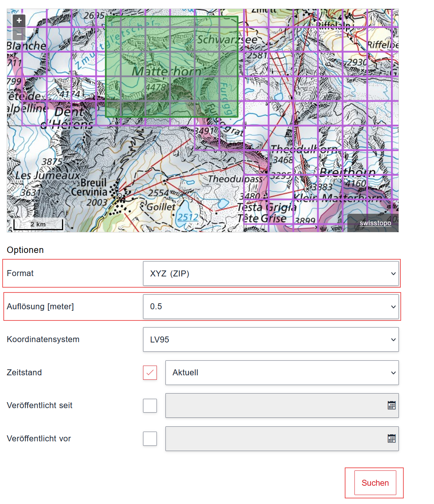
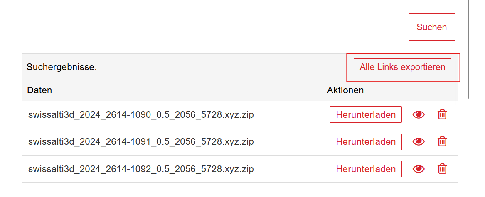

# SwissTopo STL Converter (GUI-first)

## Get the SwissTopo CSV (first step)

Download the CSV of swissALTI3D tiles from SwissTopo and place it into `data/` (recommended). The GUI can also browse to the CSV anywhere on disk and optionally copy it into `data/`.

1. Open the swissALTI3D page and select the tiles you want.
2. Export or download the CSV from the selection.
3. Save the CSV into `data/` so the GUI picks it up automatically, or browse to it directly from the app.




Source page:
```text
https://www.swisstopo.admin.ch/de/hoehenmodell-swissalti3d
```

This project is built around the GUI. Use it to download SwissTopo XYZ or GeoTIFF tiles, convert them into STL tiles, and merge them into a single printable STL with optional base, border clipping, and lake lowering.

Prefer GeoTIFF (COG) when available because it is much smaller than ASCII XYZ.

Run the GUI:

```bash
python gui.py
```

---

## Setup so it just works (Windows only)

Follow these steps once on each Windows computer. After that, you can launch the GUI with a double-click or one command.

**1) Install Python (once)**
- Install **Python 3.10+** from python.org.
- During install, check **"Add Python to PATH"**.

**2) Get the project**
- Option A: Download the ZIP from GitHub and extract it.
- Option B: Use Git to clone the repo.

**3) Install the required packages (once per machine)**

```bash
py -3 -m pip install --upgrade pip
py -3 -m pip install numpy
```

Optional, only if needed:

```bash
py -3 -m pip install scipy
py -3 -m pip install rasterio
py -3 -m pip install shapely pyshp
```

- `scipy`: triangulation fallback for non-grid XYZ data
- `rasterio`: GeoTIFF / COG input
- `shapely` and `pyshp`: border clipping, region filtering, and lake lowering

**Optional: use Conda instead of the system Python**

```bash
conda create -n swisstopo-stl python=3.11 -y
conda activate swisstopo-stl
python -m pip install --upgrade pip
python -m pip install numpy
```

**4) Start the GUI**

```bash
py -3 gui.py
```

---

## Current GUI Workflow

The current GUI is organized around a simple default path:

1. Select a SwissTopo CSV or use files already in `data/`
2. Choose the final model size and a detail preset
3. Click **Run Full Pipeline**

The app also exposes step-by-step buttons if you want manual control:

1. **Run Download**
2. **Create STL Tiles**
3. **Build Final STL**

At the top of the window, the pipeline summary shows detected inputs, tile STL status, and the final STL path. The default workflow keeps advanced controls hidden until you enable them.

### Detail presets

- **Draft**: fastest conversion, lighter STL files
- **Balanced**: default for most prints
- **Fine**: more terrain detail, slower and larger output
- **Custom**: unlocks manual conversion controls

### Advanced panels

When needed, enable:

- **Show advanced conversion settings**
- **Show advanced merge settings**

This reveals controls such as manual step size, explicit scale source, grid tolerance, worker count, weld tolerance, merge-only Z scaling, border clipping, and lake lowering.

---

## Step 1: Download XYZ/TIF tiles

This step downloads ZIP tiles from a CSV of URLs and extracts XYZ files into `data/xyz`. It also supports GeoTIFF or COG URLs that download directly into `data/tif`.

**How to use it**
- Click **Browse** and select your CSV with download URLs.
- Optionally click **Copy to data/** to keep a copy inside the project.
- Click **Run Download**.
- If existing terrain tiles are found, the GUI can prompt to clean them first.

**CSV expectations**
- One URL per line is enough.
- If the file has multiple columns, only the first column is used.
- Comment lines starting with `#` are ignored.
- Supports ZIPs containing XYZ and direct GeoTIFF/COG URLs.

**Typical SwissTopo sources**
- swissALTI3D (DTM)
- swissSURFACE3D Raster (DSM)

---

## Step 2: Convert XYZ/TIF to STL tiles

This step converts every `.xyz` file in `data/xyz` and every `.tif/.tiff` file in `data/tif` into one STL tile per file in `output/tiles`.

### Default conversion flow

In the current GUI, the normal path is:

- Choose a final model size in millimeters
- Pick a preset such as **Balanced**
- Let the app derive the conversion settings automatically

### Advanced conversion options

When **Custom** mode or advanced conversion is enabled, you can control:

- **Downsample step**: keep every Nth point in X and Y
- **Tile size (mm for 1 km)**: fixed physical tile size workflow
- **Scale ratio**: for example `1:100`
- **Grid tolerance**: snap noisy XY coordinates to a grid
- **Max parallel conversions**
- **Z scale (tile conversion)**: vertical exaggeration during tile generation

**Tip**
- Delete old tile STLs before a fresh run so unrelated tiles do not get merged later.

---

## Step 3: Merge tiles into final STL

This step merges all tiles in `output/tiles` into a single STL and can also prepare it for printing.

### Main merge options

- **Output STL path**: where the final STL is saved
- **Add printable base**: creates a watertight solid with walls and a flat bottom
- **Base thickness**: thickness below the terrain minimum
- **Base Z (optional)**: explicit base elevation that overrides thickness

### Advanced merge options

- **Weld tolerance**: removes seams between neighboring tiles
- **Merge Z scale**: applies Z scaling during merge only
- **Border clipping**: clip the merged terrain to a Swiss border shapefile
- **Detect touched** and region selection: limit clipping to intersecting canton or bezirk features
- **Lake lowering (mm)**: lower merged lake surfaces by a chosen amount after scaling

### Lake lowering

The new lake option works during the final merge stage.

- It is available as **Lake lowering (mm)** in the merge section
- Set it to `0` to disable
- The tool auto-detects the standing-water shapefile from `./geometry_data`
- It lowers vertices that fall inside detected lake polygons in the merged model
- This is useful when you want lakes to read more clearly in the printed terrain

For the CLI, the same feature is exposed with:

```bash
python build_stl.py --merge-stl output/terrain.stl --lake-lower-mm 1.2
```

If lake lowering is enabled and no standing-water shapefile is found in `./geometry_data`, the merge will stop with an error so the result is not silently wrong.

### Border clipping

Border clipping is optional and uses Swiss boundary shapefiles from `./geometry_data`.

- **Clip to Swiss border** trims triangles outside the chosen geometry
- **Border shapefile** lets you choose the `.shp` file
- **Border scale** supports `auto` and reuses stored tile scale information when available
- **Keep canton/bezirk** can restrict the output to specific touched regions

---

## Files and Folders

```text
project/
  gui.py
  download_tiles.py
  build_stl.py
  defaults.py
  data/
    your_urls.csv
    xyz/
      tile_001.xyz
      tile_002.xyz
    tif/
      tile_003.tif
  output/
    tiles/
      tile_001.stl
      tile_002.stl
      tile_003.stl
    terrain.stl
  geometry_data/
    swissboundaries.../
      LANDESGRENZE.shp
      KANTONSGRENZE.shp
      BEZIRKSGRENZE.shp
    swisstlm3d.../
      TLM_GEWAESSER/
        swissTLM3D_TLM_STEHENDES_GEWAESSER.shp
  images/
    selection.png
    download_csv.png
```

---

## CLI (optional)

Everything the GUI does is available from the command line if you want direct control:

```bash
python download_tiles.py --csv path/to/urls.csv
python build_stl.py --all --target-size-mm 150
python build_stl.py --merge-stl output/terrain.stl --weld-tol 0.001 --make-solid
python build_stl.py --merge-stl output/terrain.stl --lake-lower-mm 1.2
python build_stl.py --merge-stl output/terrain.stl --clip-border --border-shp geometry_data/swissboundaries.../LANDESGRENZE.shp --border-scale auto
python build_stl.py --merge-stl output/terrain.stl --clip-border --border-shp geometry_data/swissboundaries.../KANTONSGRENZE.shp --border-keep "Bern,Uri"
```

---

## Troubleshooting

**Nothing downloads**
- Check that your CSV has valid `http://` or `https://` URLs.

**Grid not detected**
- Increase **Grid tolerance** such as `0.001`.
- Check for missing points in the XYZ grid.

**STL too large**
- Use a coarser preset such as **Draft**, or increase the manual downsample step.

**Lake lowering does nothing**
- Confirm the lake lowering value is greater than `0`.
- Confirm the standing-water shapefile exists under `geometry_data`.
- Confirm the lakes actually intersect the merged model bounds.

---

## License

Free to use, modify, and adapt for terrain processing, GIS, CAD, or 3D printing workflows.
