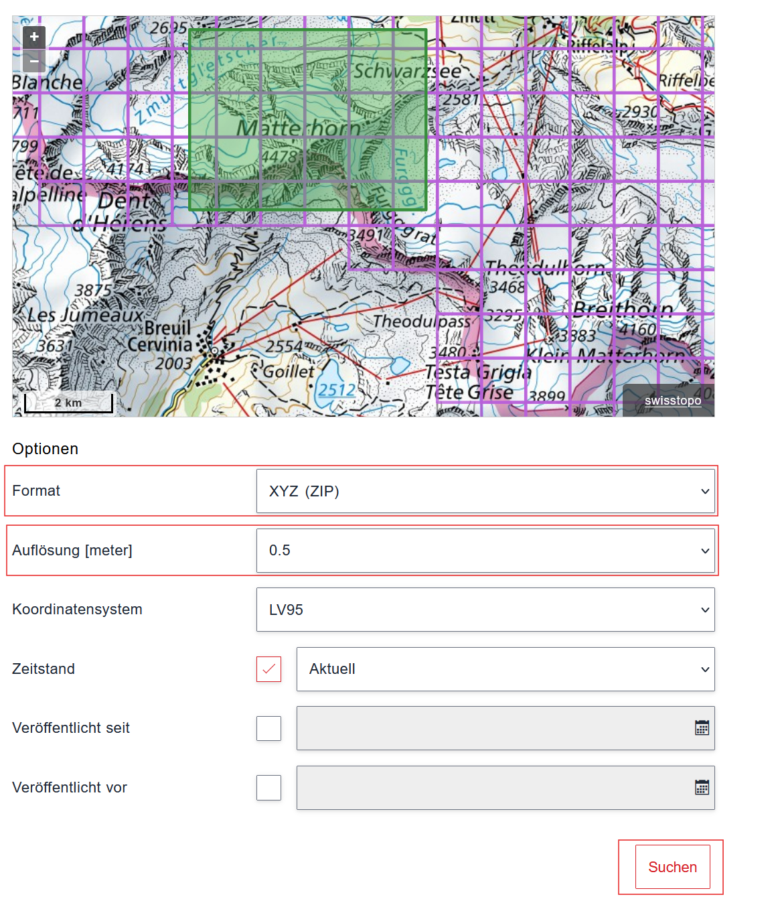
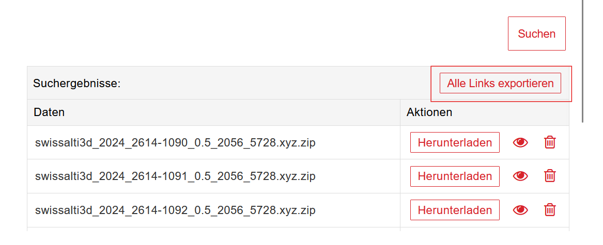

# SwissTopo STL Converter (GUI-first)

## Get the SwissTopo CSV (first step)

Download the CSV of swissALTI3D tiles from SwissTopo and place it into `data/` (recommended). The GUI can also browse to the CSV anywhere on disk and optionally copy it into `data/`.

1. Open the swissALTI3D page and select the tiles you want.
2. Export or download the CSV from the selection.
3. Save the CSV into `data/` so the GUI picks it up automatically, or browse to it directly from the app.




Source page:
```text
https://www.swisstopo.admin.ch/de/hoehenmodell-swissalti3d
```

This project is built around the GUI. Use it to download SwissTopo XYZ or GeoTIFF tiles, convert them into STL tiles, and merge them into a single printable STL with optional base, border clipping, and water lowering or cutouts.

Prefer GeoTIFF (COG) when available because it is much smaller than ASCII XYZ.

Run the GUI:

```bash
python gui.py
```

---

## Setup so it just works

The recommended setup is to use the included Conda environment file:

```text
environment.yml
```

This file records the Python version and the packages needed by the project, including the geospatial libraries used for GeoTIFF input, border clipping, water handling, and geometry handling.

The file is intentionally longer than a normal hand-written requirements list. It was exported from the working `swisstopo-stl` Conda environment, so it includes both the packages used directly by the code and the lower-level native libraries they need, such as GDAL, PROJ, TIFF/PNG/JPEG support, SQLite, OpenSSL, MKL, and Windows runtime packages. This makes the environment more reproducible.

Follow these steps once on each computer. After that, you can launch the GUI with one command.

**1) Install Conda**
- Install Miniconda or Anaconda.
- On Windows, use the **Anaconda Prompt** or a terminal where `conda` is available.

**2) Get the project**
- Option A: Download the ZIP from GitHub and extract it.
- Option B: Use Git to clone the repo.

**3) Create the project environment**

From the project folder, run:

```bash
conda env create -f environment.yml
```

This creates an environment named:

```text
swisstopo-stl
```

If the environment already exists and you want to update it after `environment.yml` changes, run:

```bash
conda env update -n swisstopo-stl -f environment.yml --prune
```

**4) Activate the environment**

```bash
conda activate swisstopo-stl
```

**5) Start the GUI**

```bash
python gui.py
```

### Optional: minimal pip setup

If you do not want to use Conda, you can try a smaller manual Python setup. This is less reproducible, especially for `rasterio`, `fiona`, and GDAL on Windows.

```bash
py -3 -m pip install --upgrade pip
py -3 -m pip install numpy scipy rasterio fiona shapely pyshp
```

---

## Current GUI Workflow

The current GUI is organized around a simple default path:

1. Select a SwissTopo CSV or use files already in `data/`
2. Choose the final model size and a detail preset
3. Use the step buttons in order: **Run Download**, **Create STL Tiles**, then **Build Final STL**

The default workflow keeps advanced controls hidden until you enable them.

### Detail presets

- **Draft**: fastest conversion, lighter STL files
- **Balanced**: default for most prints
- **Fine**: more terrain detail, slower and larger output
- **Custom**: used when you type your own point spacing
- **Use full input resolution**: keeps every source sample; this can create very large STL files

### Advanced panels

When needed, enable:

- **Show advanced overrides**
- **Show advanced merge overrides**

This reveals controls such as manual step size, explicit scale source, grid tolerance, worker count, weld tolerance, merge-only Z scaling, border clipping, and water handling.

---

## Step 1: Download XYZ/TIF tiles

This step downloads ZIP tiles from a CSV of URLs and extracts XYZ files into `data/xyz`. It also supports GeoTIFF or COG URLs that download directly into `data/tif`.

**How to use it**
- Click **Browse** and select your CSV with download URLs.
- Optionally click **Copy to data/** to keep a copy inside the project.
- Click **Run Download**.
- If existing terrain tiles are found, the GUI can prompt to clean them first.

**CSV expectations**
- One URL per line is enough.
- If the file has multiple columns, only the first column is used.
- Comment lines starting with `#` are ignored.
- Supports ZIPs containing XYZ and direct GeoTIFF/COG URLs.

**Typical SwissTopo sources**
- swissALTI3D (DTM)
- swissSURFACE3D Raster (DSM)

---

## Step 2: Convert XYZ/TIF to STL tiles

This step converts every `.xyz` file in `data/xyz` and every `.tif/.tiff` file in `data/tif` into one STL tile per file in `output/tiles`.

### Default conversion flow

In the current GUI, the normal path is:

- Choose a final model size in millimeters
- Pick a preset such as **Balanced**
- Let the app derive the conversion settings automatically

### Advanced conversion options

When **Show advanced overrides** is enabled, you can control:

- **Downsample step**: keep every Nth point in X and Y
- **Tile size (mm for 1 km)**: fixed physical tile size workflow
- **Scale ratio**: for example `1:100`
- **Use full input resolution**: equivalent to downsample step `1`
- **Grid tolerance**: snap noisy XY coordinates to a grid
- **Max parallel conversions**
- **Z scale (tile conversion)**: vertical exaggeration during tile generation
- **Crop rectangle**: optional SwissTopo-style rectangle (`West, South, East, North`) to convert only a smaller area inside downloaded tiles; disable it to ignore the rectangle fields

**Tip**
- Delete old tile STLs before a fresh run so unrelated tiles do not get merged later.

---

## Step 3: Merge tiles into final STL

This step merges all tiles in `output/tiles` into a single STL and can also prepare it for printing.

### Main merge options

- **Output STL path**: where the final STL is saved
- **Add printable base**: creates a watertight solid with walls and a flat bottom
- **Base thickness**: thickness below the terrain minimum
- **Base Z (optional)**: explicit base elevation that overrides thickness
- **Surface adjustments**: lower or remove selected lake and river surfaces in the merged model
- **Optional border / region clip**: merge all tiles, or clip to a selected border, canton, or bezirk

### Advanced merge options

- **Weld tolerance**: removes seams between neighboring tiles
- **Merge Z scale**: applies Z scaling during merge only
- **Detect touched** and region selection: limit clipping to intersecting canton or bezirk features
- **Clean tile STLs after merge**: deletes intermediate tile files after the final STL is written

### Water Lowering And Cutouts

Water handling works during the final merge stage.

- It is available as **Water treatment** in the merge section
- **off** disables water handling
- **lower** lowers detected lake and river vertices by the configured amount
- **remove** deletes detected lake and river surface faces, producing cutouts when a printable base is added
- **Water features** controls whether the operation applies to lakes, rivers, or both
- **Specific water** works like the border region selector. Click **Detect touched** to list lakes/rivers that intersect the current tiles, leave **(all touched water)** selected for every touched feature, or select individual lake/river rows to affect only those.
- Lakes come from `TLM_STEHENDES_GEWAESSER`
- The pruning helper also builds `TLM_LAKE_POLYGONS`, and the app prefers it for lake removal so large lakes are removed as full polygons instead of shoreline fragments
- Rivers come from `TLM_FLIESSGEWAESSER`, are grouped by SwissTopo watercourse ID, and are buffered with **River width (mm)** in final model units
- River/lake rows show the official SwissTopo `NAME` when present. If SwissTopo does not provide a name for that feature, the GUI shows a fallback such as `Unnamed river 102102`.
- Bridges are protected from river lowering/removal using road and railway features whose `KUNSTBAUTE` value is a bridge

For the black-cardboard workflow, use **Water treatment: remove** together with **Add printable base** and leave **Lakes** selected. The merge removes selected water faces before the base is generated, so the solidifier creates side walls around those openings and leaves through-holes for the backing sheet to show through.

The current official SwissTopo source is swissTLM3D from the SwissTopo OGD download page:

```text
https://ogd.swisstopo.admin.ch/ch.swisstopo.swisstlm3d?lang=en
```

Download the current `swisstlm3d_..._2056_5728.shp.zip` package and extract these layers under `./geometry_data`:

```text
TLM_GEWAESSER/swissTLM3D_TLM_STEHENDES_GEWAESSER.*
TLM_GEWAESSER/swissTLM3D_TLM_FLIESSGEWAESSER.*
TLM_STRASSEN/swissTLM3D_TLM_STRASSE.*
TLM_OEV/swissTLM3D_TLM_EISENBAHN.*
```

After extraction, run the geometry pruning helper to keep disk use low. It creates a lake polygon layer, creates a compact bridge-only layer, deletes the full road/rail sources, removes unused SwissTLM3D layers, and keeps the water DBF files so lake and river names can be shown in the GUI:

```bash
python tools/prune_geometry_data.py
```

For the CLI, the same feature is exposed with:

```bash
python build_stl.py --merge-stl output/terrain.stl --water-mode lower --water-lower-mm 1.2
python build_stl.py --merge-stl output/terrain.stl --water-mode remove --river-width-mm 0.8
python build_stl.py --merge-stl output/terrain.stl --water-mode remove --water-features lakes,rivers --river-width-mm 0.8
python build_stl.py --merge-stl output/terrain.stl --water-mode remove --water-features lakes --make-solid
python build_stl.py --merge-stl output/terrain.stl --water-mode remove --water-features lakes --water-feature-ids lake:0,lake:2 --make-solid
```

The GUI generates `lake:N` and `river:N` IDs after **Detect touched**. If the SwissTopo `NAME` field is available, the water selector shows it; otherwise it falls back to type, center, and approximate size.

The old `--lake-lower-mm 1.2` flag still works as an alias for lake-and-river lower mode. If water handling is enabled and required standing-water or river shapefiles are missing in `./geometry_data`, the merge stops with an error so the result is not silently wrong.

### Border clipping

Border clipping is optional and uses Swiss boundary shapefiles from `./geometry_data`.

- **Clip to Swiss border** trims triangles outside the chosen geometry
- **Border shapefile** lets you choose the `.shp` file
- **Border scale** supports `auto` and reuses stored tile scale information when available
- **Keep canton/bezirk** can restrict the output to specific touched regions

---

## Files and Folders

```text
project/
  gui.py
  download_tiles.py
  build_stl.py
  defaults.py
  data/
    your_urls.csv
    xyz/
      tile_001.xyz
      tile_002.xyz
    tif/
      tile_003.tif
  output/
    tiles/
      tile_001.stl
      tile_002.stl
      tile_003.stl
    terrain.stl
  geometry_data/
    swissboundaries.../
      LANDESGRENZE.shp
      KANTONSGRENZE.shp
      BEZIRKSGRENZE.shp
    swisstlm3d.../
      TLM_GEWAESSER/
        swissTLM3D_TLM_STEHENDES_GEWAESSER.shp
        swissTLM3D_TLM_FLIESSGEWAESSER.shp
      TLM_BRIDGES/
        swissTLM3D_TLM_BRIDGE_PROTECTION.shp
  images/
    selection.png
    download_csv.png
```

---

## CLI (optional)

Everything the GUI does is available from the command line if you want direct control:

```bash
python download_tiles.py --csv path/to/urls.csv
python build_stl.py --all --target-size-mm 150
python build_stl.py --all --target-size-mm 150 --input-resolution
python build_stl.py --all --target-size-mm 150 --crop-rect 2600000 1200000 2600500 1200400
python build_stl.py --merge-stl output/terrain.stl --weld-tol 0.001 --make-solid
python build_stl.py --merge-stl output/terrain.stl --water-mode lower --water-lower-mm 1.2
python build_stl.py --merge-stl output/terrain.stl --water-mode remove --river-width-mm 0.8 --make-solid
python build_stl.py --merge-stl output/terrain.stl --water-mode remove --water-features lakes --make-solid
python build_stl.py --merge-stl output/terrain.stl --clean-tiles-after-merge
python build_stl.py --merge-stl output/terrain.stl --clip-border --border-shp geometry_data/swissboundaries.../LANDESGRENZE.shp --border-scale auto
python build_stl.py --merge-stl output/terrain.stl --clip-border --border-shp geometry_data/swissboundaries.../KANTONSGRENZE.shp --border-keep "Bern,Uri"
```

---

## Troubleshooting

**Nothing downloads**
- Check that your CSV has valid `http://` or `https://` URLs.

**Grid not detected**
- Increase **Grid tolerance** such as `0.001`.
- Check for missing points in the XYZ grid.

**STL too large**
- Use a coarser preset such as **Draft**, or increase the manual downsample step.

**Water handling does nothing**
- Confirm **Water treatment** is set to **lower** or **remove**.
- For lower mode, confirm the lower value is greater than `0`.
- Confirm the standing-water and flowing-water shapefiles exist under `geometry_data`.
- Confirm the water features actually intersect the merged model bounds.

---

## License

Free to use, modify, and adapt for terrain processing, GIS, CAD, or 3D printing workflows.
